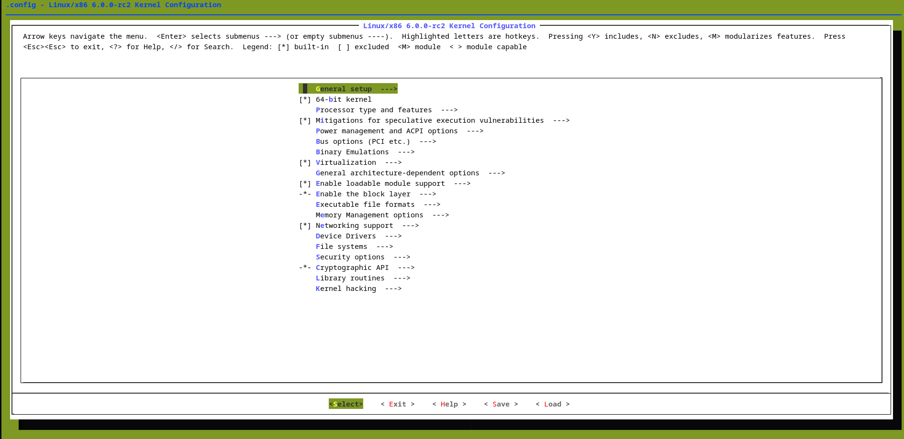
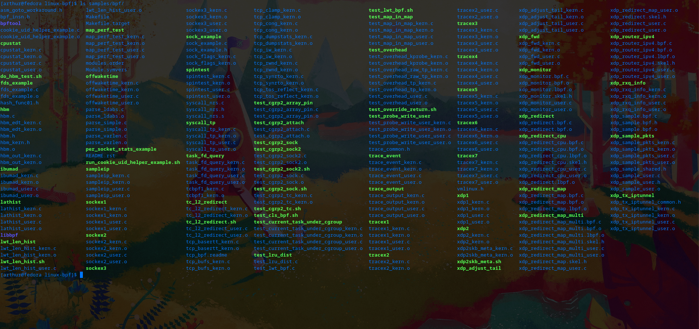

# How to compile eBPF /linux/samples/bpf

## Download source code:
```sh
git clone git@github.com:torvalds/linux.git
```
```sh
# make sure you have all dependencies to deal with linux kernel compilation and if not
sudo dnf install curl
curl -OL https://raw.githubusercontent.com/arthunix/dotfiles/main/linux-kernel-dev-config.sh
chmod +x linux-kernel-dev-config.sh
./linux-kernel-dev-config.sh
```
```sh
make defconfig
make menuconfig
```


```sh
# Make sure the options are in .config
# You can use the "/" key to look for a config in menuconfig
CONFIG_CGROUP_BPF=y
CONFIG_BPF=y
CONFIG_BPF_SYSCALL=y
CONFIG_NET_SCH_INGRESS=m
CONFIG_NET_CLS_BPF=m
CONFIG_NET_CLS_ACT=y
CONFIG_BPF_JIT=y
CONFIG_LWTUNNEL_BPF=y
CONFIG_HAVE_EBPF_JIT=y
CONFIG_BPF_EVENTS=y
CONFIG_TEST_BPF=m
DEBUG_INFO_BTF=y
DEBUG_INFO_BTF_MODULES=y
```
```sh
make -j(nproc)
```
```sh
make headers_install
bpftool btf dump file vmlinux format c > samples/bpf/vmlinux.h
make M=samples/bpf
```
